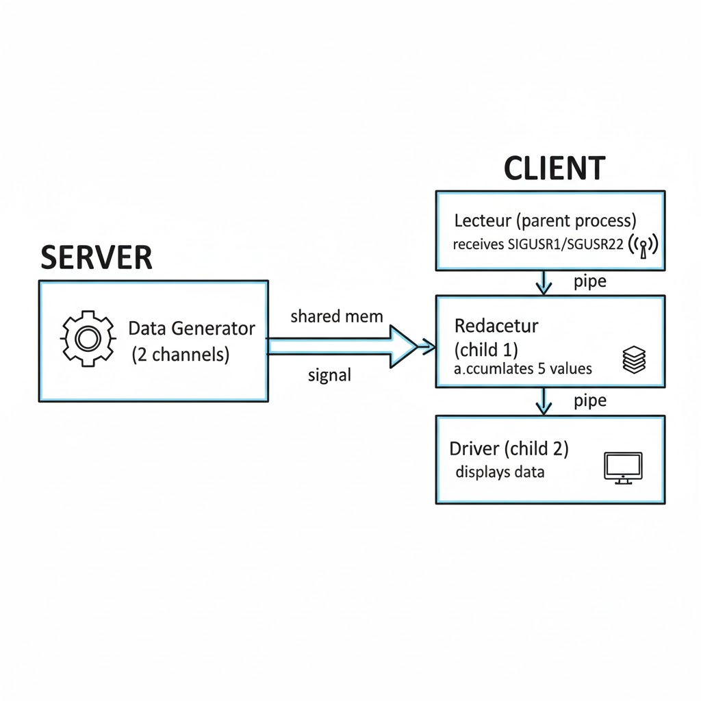

# Client-Server IPC System

A multi-process client-server application in C that demonstrates inter-process communication (IPC) using POSIX and System V mechanisms. Built as part of a real-time systems course (SEPC -- Systemes d'Exploitation et Programmation Concurrente).

The server generates real-time data on two independent channels and broadcasts availability to connected clients through signals. Each client reads the data from shared memory, processes it through an internal pipeline of cooperating processes, and displays the results.


## Table of Contents

- [Architecture](#architecture)
- [IPC Mechanisms](#ipc-mechanisms)
- [Data Flow](#data-flow)
- [Project Structure](#project-structure)
- [Prerequisites](#prerequisites)
- [Build](#build)
- [Usage](#usage)
- [Configuration](#configuration)
- [License](#license)


## Architecture

The system follows a multi-process architecture on both sides.

**Server** (provided as course material) -- spawns two child processes:

| Process | Responsibility |
|---|---|
| Receptionist | Handles client connection and disconnection requests via message queues |
| Data Generator | Produces data on two channels at one-second intervals, writes to shared memory, and signals all connected clients |

**Client** (implemented from scratch) -- spawns two child processes alongside the parent:

| Process | Responsibility |
|---|---|
| Lecteur (parent) | Catches `SIGUSR1`/`SIGUSR2` signals, reads the corresponding data buffer from shared memory, and forwards the value to the Redacteur through a pipe |
| Redacteur (child) | Accumulates five data values from the Lecteur, then transmits the batch to the Driver through a second pipe |
| Driver (child) | Receives batches of five values from the Redacteur and prints them to the terminal |


## IPC Mechanisms

| Mechanism | Role in the System |
|---|---|
| System V Message Queues | Connection/disconnection protocol between client and server (connect, ACK, disconnect) |
| System V Shared Memory | Server writes data buffers; clients read them (two channels, 3600 integers each) |
| System V Semaphores | Mutex protecting concurrent writes to shared memory buffers on the server side |
| POSIX Signals (`SIGUSR1`, `SIGUSR2`) | Server notifies clients when new data is available on channel 1 or channel 2 |
| POSIX Pipes | Intra-client communication: Lecteur to Redacteur to Driver |
| `fork()` | Process creation on both server and client sides |


## Data Flow


1. The server writes a new value into one of two circular buffers in shared memory and sends `SIGUSR1` (channel 1) or `SIGUSR2` (channel 2) to every registered client PID.
2. The Lecteur catches the signal, reads the latest value from the corresponding buffer, and writes it into a pipe.
3. The Redacteur reads values from the pipe. After collecting five values, it forwards the batch through a second pipe.
4. The Driver reads the batch and prints all five values to standard output.


## Project Structure

```
.
├── client/                 Client source code (student implementation)
│   ├── CL.c                Main entry point -- process creation, signal setup, timed execution
│   ├── CL_def.h            Shared constants and type definitions
│   ├── CL_include          Common system includes
│   ├── moniteur.c/.h       Messaging setup, connection/disconnection, shared memory init
│   ├── lecteur.c/.h        Signal handlers that read from shared memory and write to pipe
│   ├── redacteur.c/.h      Reads from pipe, batches values, forwards to driver
│   ├── driver.c/.h         Reads batched values from pipe and displays them
│   └── Makefile
│
├── server/                 Server source code (provided)
│   ├── SV.c                Entry point -- resource check, launches sv_zz
│   ├── SV_main.c           Core server logic -- resource init, process creation, data loop
│   ├── SV_connect.c/.h     Client registration and deregistration
│   ├── SV_data.c/.h        Data generation and client signaling
│   ├── SV_msg.c/.h         Message queue creation and management
│   ├── SV_mem.c/.h         Shared memory allocation
│   ├── SV_sem.c/.h         Semaphore (mutex) creation and P/V operations
│   ├── SV_init.c/.h        Key file management and initialization
│   ├── SV_def.h            Shared constants and type definitions
│   ├── SV_include          Common system includes
│   └── Makefile
│
├── docs/
│   └── Sujet_MiniProjet_SEPC.pdf   Original assignment specification
│
├── .gitignore
└── README.md
```


## Prerequisites

- Linux operating system (required for System V IPC)
- GCC compiler
- Make


## Build

Build the server and client separately:

```bash
# Build the server
cd server
make

# Build the client
cd ../client
make
```

To clean build artifacts:

```bash
cd server && make clean
cd ../client && make clean
```


## Usage

The server and client must run in **separate terminals**.

**Terminal 1 -- Start the server:**

```bash
cd server
./SV <duration_in_seconds>
```

Example: `./SV 60` runs the server for 60 seconds.

**Terminal 2 -- Start the client:**

```bash
cd client
./CL <duration_in_seconds>
```

Example: `./CL 30` runs the client for 30 seconds. If no argument is given, the client defaults to 25 seconds.

The client will connect to the running server, receive real-time data through shared memory, and display processed output in batches of five values.

To stop either process early, press `Ctrl+C`. The client handles `SIGINT` gracefully by sending a disconnection message to the server before exiting.


## Configuration

Key parameters are defined in `client/CL_def.h` and `server/SV_def.h`:

| Parameter | Value | Description |
|---|---|---|
| `NVOIES` | 2 | Number of data input channels |
| `NCL_MAX` | 10 | Maximum number of simultaneous clients |
| `BUF_SZ` | 3600 | Size of each channel's circular buffer (number of integers) |
| `L_MSG` | 200 | Maximum message length in bytes |


## License

This project was developed for educational purposes as part of the SEPC course curriculum.
